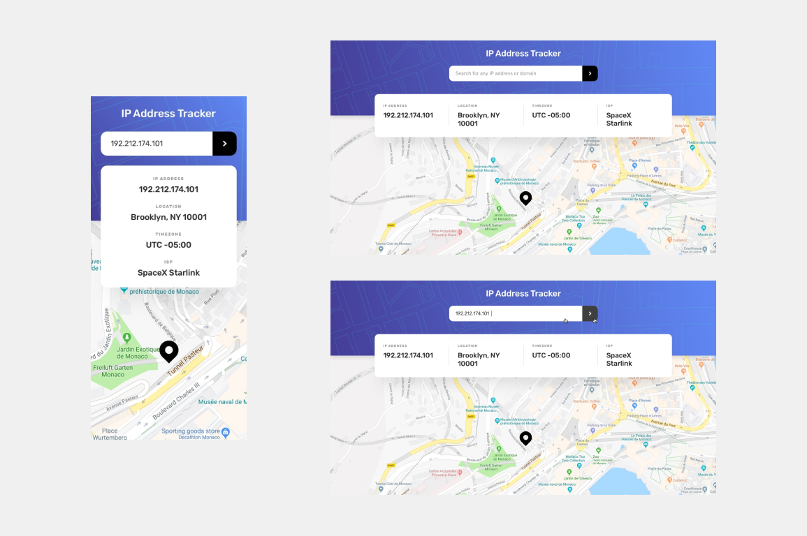

### Article Preview Component Challange
'Your challenge is to build out this IP Address Tracker app and get it looking as close to the design as possible. To get the IP Address locations, you'll be using the IP Geolocation API by IPify. To generate the map, we recommend using LeafletJS.'

**Your users should be able to:**

* View the optimal layout for each page depending on their device's screen size
* See hover states for all interactive elements on the page
* See their own IP Address on the map on the initial page load
* Search for any IP addresses or domains and see the key information and location

#### Designs

#### Live 

https://https://ip-tracker-roan.vercel.app/k